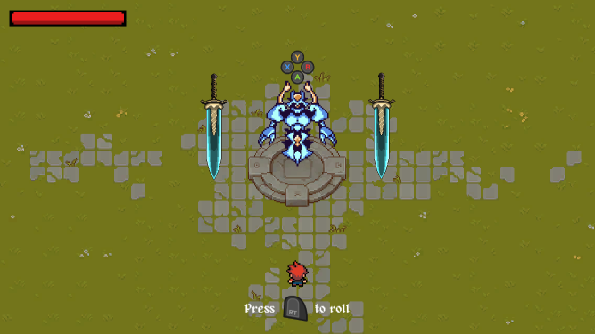
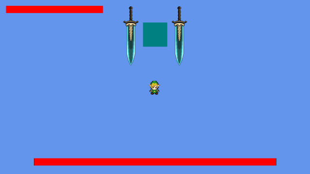

# Memory Souls

Memory Souls is a top-down Souls-like game made as a proof of concept. Memory Souls was originally made in Monogame using Prime31's Nez framework, and was later ported to Unity over a few days. 

## Controls
Controller recommended

- Move: WASD / Left Stick
- Roll: Spacebar / Right Trigger
- Attacks: Arrow keys / Face Buttons
- Quit: ESC

## How to Play
- Browser: https://kevinni73.github.io/MemorySouls/
    - note: the WebGL build can't detect input device changes, will always display Xbox controls
- Windows PC: Unzip "Memory Souls Windows Build.zip" in the /Build folder and run "Memory Souls.exe"

## Screenshots

Old Version in Monogame, for posterity:

## Assets
- Player sprites by [Gamekrazzy](https://gamekrazzy.itch.io/8-direction-top-down-character)
- Crystal Knight by [Brother Daniel](https://brotherdaniel.itch.io/crystal-knight)
- Background sprites by [Cainos](https://cainos.itch.io/pixel-art-top-down-basic)
- Moonlight Greatsword by [DatGuyJekkt](https://www.deviantart.com/datguyjekkt/art/PIXEL-ART-Dark-Souls-Moonlight-Greatsword-795459841), Creative Commons Attribution 3.0 License
- Input key prompts by [XELU](https://thoseawesomeguys.com/prompts/), Creative Commons 0 License
- Music by [Wingless Seraph](https://wingless-seraph.net/en/material-music_boss.html)

## License
[MIT](https://choosealicense.com/licenses/mit/)